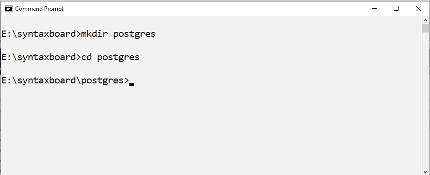

# postgres-docker
. Create a directory on the local system and call it postgres.
   
   From the command prompt run the following cmd:
   
   ```
   mkdir postgres
   
   ```   
   
    
  
2. Clone the postgres repository to that folder.
   
   From the command prompt run the following cmd:
   
   ```
   git clone https://github.com/tinitiate/postgres-docker.git
   
   ```
   
    
   
    

3. Open commmad prompt and run the Docker command from postgres as required.

    ### Command to run the docker in the background
    ```
    docker network create tinitiate
    docker-compose up -d
    ```
    ### Command to remove the container 
    ```
    docker-compose down
    ```
    ### Command to force the docker recreate the image and container
    ```
    docker-compose up --force-recreate "Service Name Specified in the docker in this case it db"
    ```
    ### Command to list all the containers
    ```
    docker ps  -a
    ```
    ### Command to force remove the container
    ```
    docker ps  -a
    docker rm "conatiner_id" from the above command.
    ```

    ### Creating and filling a Postgres DB with Docker Compose
    A PostgreSQL database is created and filled with tables in this project.Tables and data are stored in the sql folder.

    ### Parameteres for Docker Compose
    | Parameter          | Description|
    | :---               |:----  | 
    | POSTGRES_USER      |user name to connect postgres|
    | POSTGRES_PASSWORD  |password to connect postgres|        
    | POSTGRES_DB        |database name|
    | Port               |On the host, use the port 5432, which is mapped by Postgres as 5432 in your container| 

